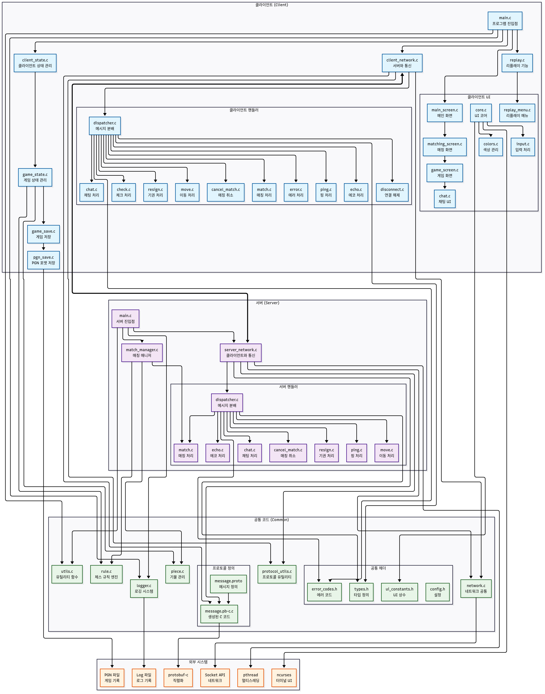

<!-- PROJECT LOGO -->
<br />
<div align="center">
  <a href="https://github.com/SysProgCompArch/multiplay-chess">
    
  </a>

  <h3 align="center">TUI 기반 멀티플레이 체스 게임</h3>

  <p align="center">
    Multiplayer Chess Game - 2025-1 시스템프로그래밍 001분반 1팀 팀프로젝트
  </p>
</div>

## 📌 프로젝트 개요

Linux에서 C로 구현된 터미널 기반 멀티플레이어 체스 게임입니다. 컴파일하는 동안 (합법적으로) 가벼운 체스 게임을 즐기고 싶은 개발자를 위해 설계되었습니다 — GUI 오버헤드 없이 순수한 CLI의 매력을 경험하세요!

- 전체 코드 라인 수(C언어): 6,108라인
- 클라이언트 3,345라인, 서버 1,300라인, 공통 코드 773라인

## 🎮 주요 기능

### 🧑 사용자 및 매치메이킹

- 닉네임만 입력해 간편 접속
- 중앙 서버 기반 자동 매칭

### ♟️ 게임플레이

- TUI 기반 체스 UI (체스판, 기물, 메뉴 등)
- 체스 규칙 완전 구현 (캐슬링, 프로모션, 앙파상, 3수 동형 등)
- PGN 포맷으로 기보 저장 및 리플레이

### 🔗 통신 기능

- 클라이언트 ↔ 서버 실시간 동기화
- 실시간 채팅 기능
- 제한 시간 동기화 (타이머)

### 🛠 기타 기능

- 마우스 클릭을 통한 체스판 조작 지원 (ncurses 활용)   
  체스판에서 옮길 기물을 클릭한 후, 옮길 위치를 클릭하여 움직일 수 있습니다.

### 📼 리플레이 기능 관련
- 리플레이는 게임 종료 시 자동으로 현재 작업 디렉토리의 `replays` 폴더에 저장됩니다.
- 리플레이 파일은 확장자가 `.pgn`인 파일로 저장됩니다.
- 클라이언트 실행 후 `2. Replay` 메뉴를 통해 리플레이 파일을 확인할 수 있습니다.
- 화살표 키 또는 엔터키로 시점을 이동할 수 있으며 Space 키로 자동 재생/정지를 할 수 있습니다.

## 📷 스크린샷

[스크린샷 목록 보기](images/screenshots)

## 📊 프로젝트 다이어그램

프로젝트 구조를 표현한 다이어그램 이미지입니다.



## ⚙️ 기술 스택

| Area           | Technologies & Tools                                        |
| -------------- | ----------------------------------------------------------- |
| Language       | C                                                           |
| Networking     | Socket API (`socket`, `bind`, `listen`, `accept`, `select`) |
| Multithreading | `pthread`, `mutex`                                          |
| UI             | ncurses, ASCII escape codes                                 |
| Data Format    | protobuf-c                                                  |
| Game Records   | PGN (Portable Game Notation)                                |
| Build & Deploy | CMake, Docker, GitHub Actions                               |

## 🧪 개발 환경

- 운영체제: Linux (Ubuntu 24.04)
- 컴파일러: gcc
- 빌드 도구: CMake
- 협업 도구: GitHub, GitHub Actions (CI/CD)

## 🗂️ 프로젝트 구조 및 CMake 적용

이 프로젝트는 클라이언트, 서버, 그리고 공통 코드를 분리하여 관리하며, CMake를 통해 빌드 시스템을 구성합니다.

```
multiplay-chess/
│
├── CMakeLists.txt           # 최상위 CMake 설정
├── build.sh                 # 빌드 스크립트
├── README.md
│
├── common/                  # 클라이언트와 서버가 공통으로 사용하는 코드
│   ├── CMakeLists.txt
│   └── ... (common source/headers)
│
├── client/                  # 클라이언트 전용 코드
│   ├── CMakeLists.txt
│   └── ... (client source/headers)
│
└── server/                  # 서버 전용 코드
    ├── CMakeLists.txt
    └── ... (server source/headers)
```

- 공통 코드는 `common/`에 두고, 라이브러리로 빌드해서 클라이언트/서버에서 링크합니다.
- 클라이언트/서버는 각각 독립적인 실행 파일로 빌드 가능합니다

## 🛠️ 빌드 및 실행 방법

### 1. 의존성 설치

- Cmake 설치 필요
  ```sh
  sudo apt install cmake
  ```

- 라이브러리 설치 필요
  ```sh
  sudo apt install build-essential pkg-config protobuf-compiler protobuf-c-compiler libprotobuf-dev libprotobuf-c-dev libncurses-dev
  ```

### 2. 빌드 (make 또는 build.sh 사용)

아래와 같이 make 명령어 또는 build.sh 스크립트를 사용하여 빌드할 수 있습니다.

- **전체 빌드 (client, server 모두):**
  ```sh
  make

  # 또는
  ./build.sh
  ```
- **클라이언트만 빌드:**
  ```sh
  make client

  # 또는
  ./build.sh client
  ```
- **서버만 빌드:**
  ```sh
  make server

  # 또는
  ./build.sh server
  ```

- **빌드 파일 삭제**
  ```sh
  make clean

  # 또는
  rm -rf build/
  ```


빌드가 완료되면 `build/client/client`, `build/server/server`에 실행 파일이 생성됩니다.

---

### 3. 실행 방법

- 클라이언트 실행:
  ```sh
  ./run.sh client

  # 또는
  ./build/client/client
  ```
- 서버 실행:
  ```sh
  ./run.sh server

  # 또는
  ./build/server/server
  ```

클라이언트/서버 기본 포트는 8080입니다. 포트를 변경하려면 명령행 인자 `-p`를 사용하세요.

- 클라이언트 실행 (8081 포트) 예시:
  ```sh
  ./run.sh client -p 8081
  ```
- 서버 실행 (8081 포트) 예시:
  ```sh
  ./run.sh server -p 8081
  ```

클라이언트의 경우, 게임서버의 호스트명(IP주소, 도메인 이름 등)도 변경할 수 있습니다. 기본값은 `localhost`(`127.0.0.1`)입니다. 호스트명을 변경하려면 명령행 인자 `-h`를 사용하세요.

- 클라이언트 실행 (8081 포트, 192.168.0.100 호스트) 예시:
  ```sh
  ./run.sh client -p 8081 -h 192.168.0.100
  ```

---


#### 로그 파일 위치
- **클라이언트 로그**: `logs/chess_client_[PID].log` (PID별로 파일 출력)
- **서버 로그**: 콘솔에 색상과 함께 직접 출력

#### 로그 레벨
- `DEBUG`: 상세한 디버그 정보
- `INFO`: 일반 정보 메시지  
- `WARN`: 경고 메시지
- `ERROR`: 오류 메시지
- `FATAL`: 심각한 오류 메시지

### 클라이언트 실시간 로그 모니터링

기본적으로 클라이언트는 실행 시 로그를 `logs/` 디렉토리에 저장합니다.

`watch_logs.sh` 스크립트를 사용하여 클라이언트의 실시간 로그를 모니터링할 수 있습니다.

```sh
./watch_logs.sh
```

#### 🔍 실시간 로그 모니터링

1. **클라이언트 로그 모니터링** (권장):
   ```bash
   # 모든 클라이언트 로그를 색상과 함께 표시
   ./watch_logs.sh
   
   # 단일 로그 파일만 모니터링
   ./watch_logs.sh --single
   
   # 에러/경고만 보기
   ./watch_logs.sh --error    # ERROR, FATAL만
   ./watch_logs.sh --warn     # WARN 이상
   ./watch_logs.sh --info     # INFO 이상
   
   # 도움말 보기
   ./watch_logs.sh --help
   ```

## Protocol Buffers (protobuf-c) 사용 안내

Protocol Buffers(protobuf)는 Google에서 개발한 데이터 직렬화 형식입니다. 이 프로젝트에서는 protobuf-c를 사용하여 C 언어로 구현된 클라이언트-서버 간의 통신 메시지를 정의하고 직렬화합니다.

### 주요 특징

- **효율적인 직렬화**: JSON이나 XML보다 더 작은 크기로 데이터를 직렬화할 수 있습니다.
- **타입 안전성**: 컴파일 시점에 메시지 구조를 검증합니다.
- **언어 독립성**: 다양한 프로그래밍 언어에서 사용 가능합니다.
- **자동 코드 생성**: .proto 파일로부터 C 코드를 자동 생성합니다.

### 메시지 스펙 정의

[메시지 스펙 정의 보기](common/PROTOCOL.md)

### 디렉토리 구조

- `common/proto/` : `.proto` 파일 위치
- `common/generated/` : `protoc-c`로 생성된 C 소스/헤더 파일 위치

기본적으로 프로젝트에서 사용하는 메시지 스펙은 `common/proto/message.proto` 파일에 정의되어 있습니다. 이 파일을 수정하여 새로운 메시지 타입을 추가할 수 있습니다.

### protobuf 메시지 추가 및 컴파일

새 protobuf 메시지를 추가하려면 다음 단계를 따르세요:

1. protobuf 메시지 정의를 `common/proto/message.proto`에 추가
2. 아래 명령어로 C 파일 생성

```bash
protoc-c -I common/proto --c_out=common/generated/ common/proto/message.proto
```

또는 빌드 스크립트(./build.sh)를 실행하면 자동으로 컴파일됩니다.
